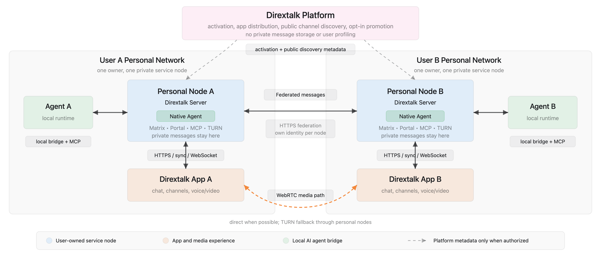

# Dirextalk Message Server

Dirextalk Message Server is the Dirextalk backend that combines a Matrix-compatible homeserver with the Dirextalk P2P product API in one Go monolith.

It is based on Element Dendrite, but this repository is maintained as a Dirextalk product server rather than a general-purpose Matrix homeserver distribution.

[中文说明](README_zh.md)

## Architecture

Each user owns a private Dirextalk service node. Personal nodes federate messages directly, while the Dirextalk Platform is limited to activation, distribution, and authorized public-discovery metadata.



## Runtime

- Production entry point: `cmd/dirextalk-message-server`
- Compatibility entry point: `cmd/dendrite`
- Docker image: `dirextalk/message-server:latest`
- Default config path in Docker: `/etc/dirextalk-message-server/message-server.yaml`
- Default data path in Docker: `/var/dirextalk-message-server`
- Go module: `github.com/YingSuiAI/dirextalk-message-server`
- Go version: `1.26.4`

## API Surface

Matrix protocol routes remain under:

- `/_matrix/*`
- `/_synapse/*`
- `/_dendrite/*`
- `/.well-known/matrix/*`

Dirextalk product APIs use the body-action surface:

- `GET /_p2p/health`
- `POST /_p2p/query`
- `POST /_p2p/command`
- `GET /_p2p/ws`
- `GET /.well-known/portal/owner.json`

Product requests use this envelope:

```json
{
  "action": "channels.public.get",
  "params": {
    "room_id": "!room:dendrite-a:8448",
    "remote_node_base_url": "https://dendrite-a:8448/_p2p"
  }
}
```

## Local Development

Run commands from the repository root. PowerShell, Bash on Linux, Bash on macOS, and Bash in WSL are all supported; choose the command form that matches the shell you are using.

Build the server:

```bash
go build ./cmd/dirextalk-message-server
go build ./cmd/dendrite
```

Run the single-node Docker stack:

```bash
docker compose -f docker-compose.p2p.yml up --build
docker compose -f docker-compose.p2p.yml exec message-server cat /var/dirextalk-message-server/p2p/bootstrap.json
```

Run the three-node regression stack.

PowerShell:

```powershell
$env:P2P_DUAL_PUBLIC_HOST = if ($env:P2P_DUAL_PUBLIC_HOST) { $env:P2P_DUAL_PUBLIC_HOST } else { "host.docker.internal" }
docker compose -f docker-compose.p2p-dual.yml up -d --force-recreate dendrite-a dendrite-b dendrite-c
python scripts/p2p-three-node-regression.py
```

Bash on Linux, macOS, or WSL:

```bash
export P2P_DUAL_PUBLIC_HOST="${P2P_DUAL_PUBLIC_HOST:-host.docker.internal}"
docker compose -f docker-compose.p2p-dual.yml up -d --force-recreate dendrite-a dendrite-b dendrite-c
python3 scripts/p2p-three-node-regression.py
```

Run tests against a local PostgreSQL instance:

PowerShell:

```powershell
$env:POSTGRES_USER = "postgres"
$env:POSTGRES_PASSWORD = "123789"
$env:POSTGRES_HOST = "localhost"
$env:POSTGRES_PORT = "5432"
$env:POSTGRES_DB = "postgres"
go test ./p2p ./internal/productpolicy -count=1
```

Bash:

```bash
export POSTGRES_USER=postgres
export POSTGRES_PASSWORD=123789
export POSTGRES_HOST=localhost
export POSTGRES_PORT=5432
export POSTGRES_DB=postgres
go test ./p2p ./internal/productpolicy -count=1
```

The Go test helper creates isolated `dendrite_test_*` databases and drops them when each test finishes.

## Documentation

Current maintained docs are intentionally small. Historical Dendrite site docs, obsolete trackers, and one-off implementation plans are not maintained in this fork.

- [Current project documentation](docs/current-project-documentation.md)
- [Implementation notes](docs/p2p-integrated-as-implementation.md)
- [API change record](docs/api-interface-change-record.md)
- [API audit and optimization notes](docs/api-audit-and-optimization.md)
- [Postman collection](docs/postman/dirextalk-message-server.postman_collection.json)
- [Plugin Postman collection](docs/postman/dirextalk-plugins.postman_collection.json)
- [Docker image notes](docs/dirextalk-message-server.md)
- [Push gateway contract](docs/dirextalk-push-gateway.md)

## License

This project retains upstream license and copyright notices where code originates from Element Dendrite. See [LICENSE](LICENSE) and [LICENSE-COMMERCIAL](LICENSE-COMMERCIAL).
